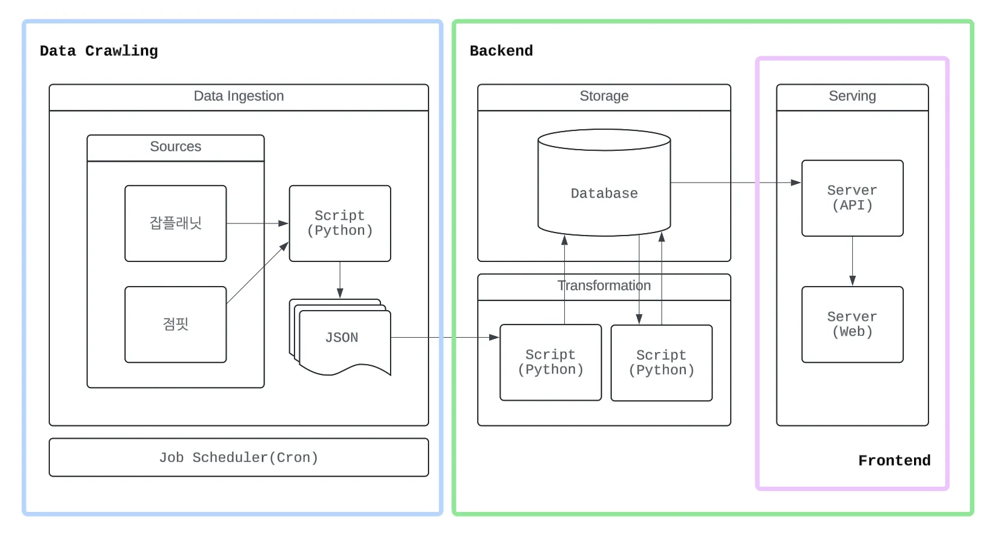
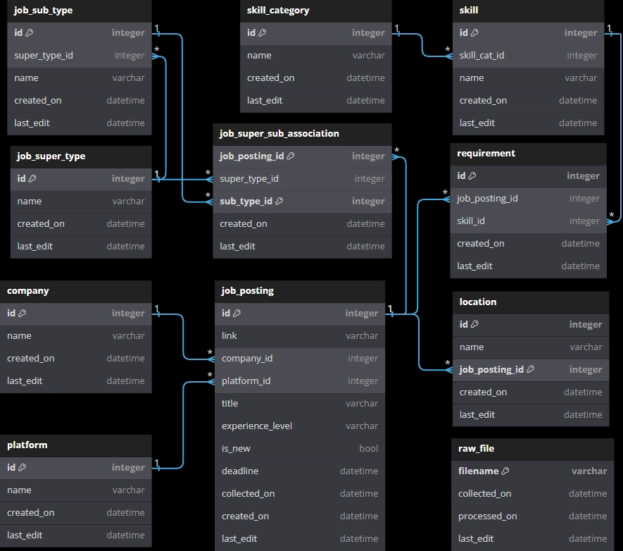
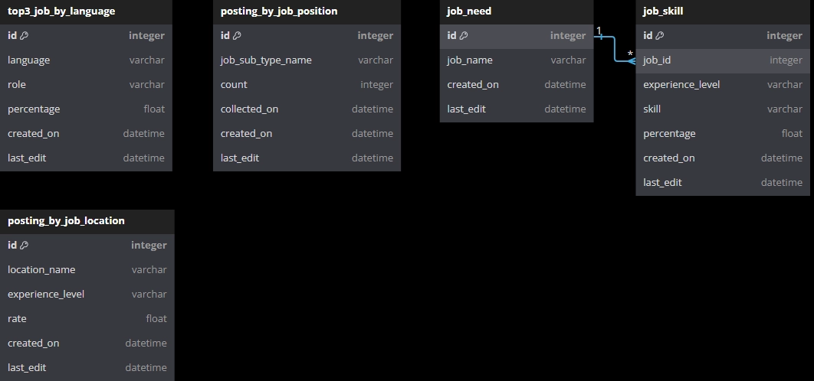
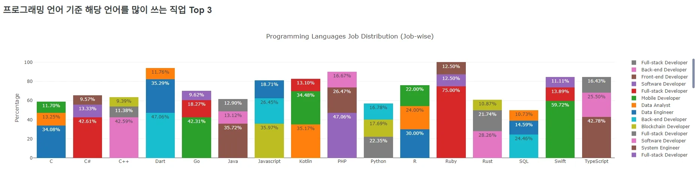

<!--
---
name: Job Trend Visualizer
date: 2024-09-30
tags: [python, django, redshift, sql]
summary: Analyzes job market data to extract structured insights on hiring trends, role distributions, and required skill sets.
---
-->

# Job Trend Visualizer

Analyzes job market data to extract structured insights on hiring trends, role distributions, and required skill sets.

### Overview
It serves as an introductory implementation of a data pipeline, providing practical experience with data collection, transformation, and analysis workflows, while laying the groundwork for more advanced concepts such as orchestration, data warehouses, and data lakes.

### What It Does
- Collects job posting data and organizes it into analyzable datasets
- Aggregates postings by role and region to identify distribution patterns
- Computes the ratio of entry-level vs. experienced positions across regions
- Extracts and categorizes technology stacks associated with different job types
- Performs relational analysis on:
  - Programming languages and job categories
  - Co-occurrence patterns between technologies
- Produces structured outputs suitable for visualization and further analysis

### Architecture

### Modeling
- Structured tables
    
- Denormalized tables
    

### The Dashboard

### Dependencies
- `Python 3.12.7`
- `Django 5.1.2`
- See `requirements.txt`